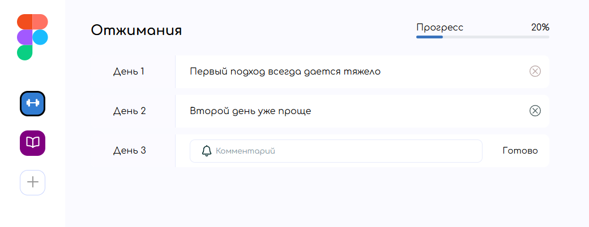
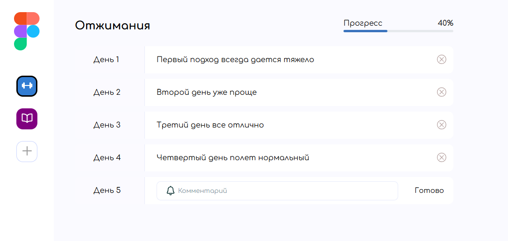
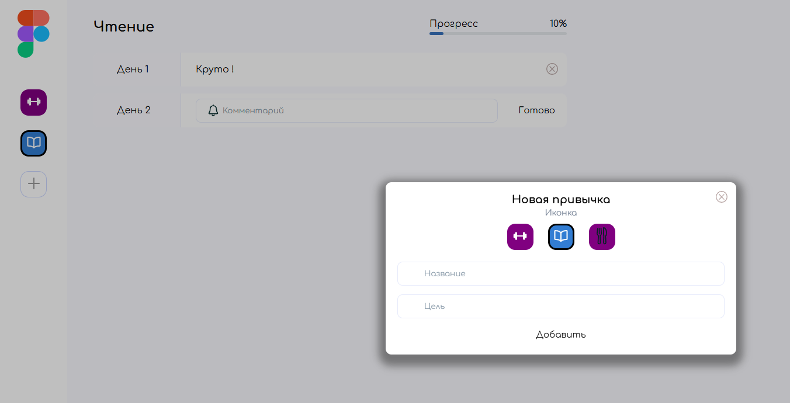

# Habit Tracker — Трекер привычек

Пет-проект: локальное веб-приложение для отслеживания ежедневных привычек с визуализацией прогресса и сохранением данных в браузере.

## Стек технологий

- **HTML5** — семантическая вёрстка
- **CSS3** — стилизация, анимации, адаптив
- **JavaScript (ES6+)** — чистый JS без фреймворков
- **БЭМ** — методология для организации CSS-классов

## Функционал

- Добавление, удаление и отметка выполнения привычек
- Подсчёт прогресса выполнения за день
- Фильтрация привычек по статусу
- Сохранение данных в localStorage (после перезагрузки данные не теряются)
- Модальные окна с плавными анимациями
- Интерактивные элементы: прогресс-бары, кастомные чекбоксы
- Динамическое обновление интерфейса без перезагрузки страницы

## Реализация

### JavaScript

- Современный синтаксис ES6+ (`let/const`, стрелочные функции, деструктуризация, шаблонные строки, spread/rest операторы)
- Работа с типами данных: примитивы, объекты, массивы (`map`, `reduce`, `find`)
- Функциональное программирование: чистые функции, замыкания (closures), функции высшего порядка
- ООП: классы, управление контекстом (`this`)
- События: делегирование событий, работа с объектом события, предотвращение стандартного поведения (`preventDefault`), кастомные события
- Формы: клиентская валидация, сбор и обработка данных из форм
- Хранение данных: работа с `localStorage`

### CSS

- **БЭМ-нейминг:** создание переиспользуемых компонентов (классы вида `button`, `button__icon`, `button--primary`) — помогает избегать конфликтов стилей в больших проектах
- **Анимации:** использование `transition` для плавных hover-эффектов и появления модальных окон

## Чему научился в процессе

- Закрепил понимание основ JavaScript
- Научился проектировать структуру данных для хранения состояния приложения
- Освоил организацию CSS-кода по методологии БЭМ
- Разобрался с делегированием событий и работой с формами
- Научился сохранять данные на клиенте с помощью localStorage

## Планы по доработке

- [ ] Добавить возможность редактирования привычек
- [ ] Реализовать статистику за неделю/месяц
- [ ] Добавить тёмную тему
- [ ] Переписать на TypeScript для тренировки

---

## Приложение

- Стартовый экран с добавленными активностями из JSON файла
 

- Экран с добавленными комментариями пользователя

- Экран с добавлением активности

---

## Связь со мной

- **Telegram:** [@wamamora](https://t.me/wamamora)

---

*Проект выполнен в учебных целях для закрепления навыков чистой frontend-разработки без использования фреймворков.*

